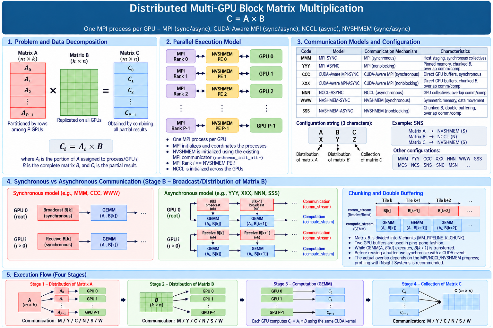

# Distributed Multi-GPU Matrix Multiplication — 1D Row-Block Decomposition

This repository is an experimental framework for **distributed double-precision matrix multiplication on multi-GPU systems**. It compares MPI, CUDA-Aware MPI, NCCL, and NVSHMEM communication strategies while keeping the same **1D row-block matrix decomposition** and CUDA multiplication kernel.

The project is designed to study **data movement, data locality, synchronization, GPU-resident communication, chunking, double buffering, and communication/computation overlap** under a controlled decomposition.



## 1. Research objective


The matrix $A$ is partitioned by rows across MPI ranks/GPUs, while the complete matrix $B$ is required by every participating GPU. Rank $i$ computes:

$C_i = A_i B$

The implementation allows the communication strategy used for **A distribution**, **B distribution**, and **C collection** to be selected independently with a three-character communication string.

---

## 2. 1D row-block domain decomposition

The decomposition implemented by this project is:

$C_i = A_i  B$

For four GPUs:

```text
              Matrix A                     Matrix B                     Matrix C

        +--------------------+       +--------------------+       +--------------------+
GPU 0 → |        A0          |       |                    |       |        C0          | ← GPU 0
        +--------------------+       |                    |       +--------------------+
GPU 1 → |        A1          |       |       Full B       |       |        C1          | ← GPU 1
        +--------------------+       |    on every GPU    |       +--------------------+
GPU 2 → |        A2          |       |                    |       |        C2          | ← GPU 2
        +--------------------+       |                    |       +--------------------+
GPU 3 → |        A3          |       |                    |       |        C3          | ← GPU 3
        +--------------------+       +--------------------+       +--------------------+
```

Therefore:

```text
GPU 0: C0 = A0 × B
GPU 1: C1 = A1 × B
GPU 2: C2 = A2 × B
GPU 3: C3 = A3 × B
```

For a square `N × N` problem with `P` MPI ranks:

```text
local_rows = N / P
A_i        = local_rows × N
B          = N × N
C_i        = local_rows × N
```

The current implementation requires:

```text
N % P == 0
```

Unlike a 2D SUMMA decomposition, this scheme does **not** partition `B` in two dimensions. Its simplicity makes it useful for isolating the cost of distributing or replicating a full `B` matrix and for studying pipelines along the GEMM K dimension.

---

## 3. Three-character communication model

The executable expects:

```bash
./mmb <device_id> <matrix_size> <ABC>
```

where the three characters select the communication mechanism used for:

```text
A → distribution of row blocks of A
B → distribution/access of the full B matrix
C → collection of row blocks of C
```

Supported characters are:

| Character | Communication model |
|---|---|
| `M` | MPI synchronous |
| `Y` | MPI asynchronous/chunked path |
| `C` | CUDA-Aware MPI synchronous |
| `X` | CUDA-Aware MPI asynchronous/chunked path |
| `N` | NCCL |
| `W` | NVSHMEM synchronous |
| `S` | NVSHMEM asynchronous/chunked path |

For example:

```text
MMM
```

uses conventional synchronous MPI for A, B, and C.

The code also supports mixed strings such as:

```text
SNS
```

which select different mechanisms for A, B, and C. This is useful for controlled experiments that isolate one phase of data movement.

The benchmark scripts supplied with the project use homogeneous combinations:

```text
MMM  YYY  CCC  XXX  NNN  WWW  SSS
```

---

## 4. Benchmark configurations

| Label | Model | B path | Chunked B/GEMM pipeline |
|---|---|---|---|
| `MMM` | MPI-SYNC | Blocking `MPI_Bcast` through host memory | No |
| `YYY` | MPI-ASYNC | `MPI_Ibcast` + pinned host staging + asynchronous H2D | Yes |
| `CCC` | CUDA-Aware MPI-SYNC | Blocking `MPI_Bcast` directly on CUDA memory | No |
| `XXX` | CUDA-Aware MPI-ASYNC | `MPI_Ibcast` directly on GPU buffers | Yes |
| `NNN` | NCCL | `ncclBroadcast` on CUDA buffers | No B/GEMM chunk pipeline in the current code |
| `WWW` | NVSHMEM-SYNC | Blocking full-B `nvshmem_double_get` | No |
| `SSS` | NVSHMEM-ASYNC | Stream-ordered nonblocking NVSHMEM GET + double buffering | Yes |

The names above describe the **implemented benchmark paths**, not universal properties of the underlying libraries.

---

## 5. Data movement by phase

Each timed iteration has three conceptual phases.

### 5.1 A — distribute row blocks

The root initially owns the complete $A$. Each rank receives:

$A_i$


with dimensions:

```text
(N / P) × N
```

Depending on the selected first character, the implementation uses MPI scatter, CUDA-Aware MPI scatter, NCCL-based distribution, or NVSHMEM GET.

### 5.2 B — make B available to every GPU

Every rank requires the complete logical matrix $B$.

For synchronous models, `B` is broadcast or fetched before GEMM.

For $Y$, $X$, and $S$, the B dimension is processed in **K chunks**, enabling a pipeline in which a subsequent $B$ chunk can be prepared while the GPU computes with the current chunk.

### 5.3 C — collect result row blocks

Each GPU produces:

$C_i$

and the local blocks are collected into the complete matrix $C$ according to the third communication character.

---

## 6. Implemented communication paths

### 6.1 MMM — MPI-SYNC

`MMM` is the conventional host-staged synchronous baseline.

For $B$:

```text
GPU B on root
      ↓ D2H
Host B
      ↓ MPI_Bcast
Host B on ranks
      ↓ H2D
GPU B
      ↓
GEMM
```

This path intentionally exposes host/device staging costs.

### 6.2 YYY — MPI asynchronous/chunked path

The asynchronous MPI B path combines:

- `MPI_Ibcast`;
- pinned host staging buffers;
- K-dimension chunking;
- two staging slots;
- `cudaMemcpyAsync`;
- CUDA streams and events.

Conceptually:

```text
B chunk 0 → MPI → H2D → GEMM
B chunk 1 → MPI → H2D → GEMM
B chunk 2 → MPI → H2D → GEMM
```

The implementation attempts to pipeline preparation of the next B chunk with computation on the current chunk. MPI requests are explicitly waited on, so the degree of real overlap depends on the implementation and target platform.

### 6.3 CCC — CUDA-Aware MPI-SYNC

`CCC` uses blocking MPI operations directly on CUDA device buffers.

For B:

```text
GPU B
  ↓
MPI_Bcast(device buffer)
  ↓
GPU B
  ↓
GEMM
```

This removes the explicit application-level host staging used by `MMM`.

### 6.4 XXX — CUDA-Aware MPI asynchronous/chunked path

The B path uses `MPI_Ibcast` directly on GPU buffers and processes `B` in K chunks with ping-pong buffers.

The intended pipeline is:

```text
Communication:  B0 -------- B1 -------- B2 -------- B3
                 |           |           |
Compute:         GEMM0 ----- GEMM1 ----- GEMM2 ----- GEMM3
```

This configuration is useful for comparing synchronous CUDA-Aware MPI (`CCC`) with a chunked nonblocking CUDA-Aware path (`XXX`).

### 6.5 NNN — NCCL

`NNN` uses NCCL collectives on CUDA-resident buffers.

The current B path performs:

```text
ncclBroadcast(full B)
        ↓
cudaStreamSynchronize()
        ↓
GEMM
```

Therefore, although NCCL operations are enqueued on a CUDA stream, the current implementation synchronizes the NCCL stream before GEMM and should **not** be described as a B/GEMM overlap implementation.

This distinction is important when interpreting results.

### 6.6 WWW — NVSHMEM-SYNC

`WWW` is the synchronous NVSHMEM baseline.

For B, non-root PEs obtain the complete matrix from PE 0 using a blocking NVSHMEM GET:

```text
PE 0 symmetric B
        ↓
nvshmem_double_get(full B)
        ↓
local symmetric B
        ↓
GEMM
```

This provides a synchronous reference for comparison with `SSS`.

### 6.7 SSS — NVSHMEM asynchronous/chunked path

`SSS` uses a chunked NVSHMEM pipeline for B based on:

```text
nvshmemx_double_get_nbi_on_stream()
nvshmemx_quiet_on_stream()
```

together with:

- K-dimension chunking;
- two B staging buffers;
- a communication stream;
- a compute stream;
- CUDA `ready` and `compute_done` events;
- ping-pong buffer reuse.

The intended steady-state behavior is:

```text
Communication stream:  GET B0 ---- GET B1 ---- GET B2 ---- GET B3
                           |           |           |
                           v           v           v
Compute stream:         GEMM B0 ---- GEMM B1 ---- GEMM B2 ---- GEMM B3
```

When the required B data is already local to the PE, the helper avoids the corresponding remote GET.

`WWW` vs. `SSS` is therefore a useful NVSHMEM comparison:

```text
WWW: blocking full-B GET
             ↓
SSS: chunked nonblocking GET + double buffering + stream pipeline
```

Because several mechanisms change simultaneously, the difference should be interpreted as the effect of the **SSS pipeline as a whole**, not as a pure measurement of asynchronous execution alone.

---

## 7. Chunk size

The pipeline chunk size is controlled by:

```bash
export PIPELINE_K_CHUNK=1024
```

If the variable is not set, the default is `1024`.

The code constrains the chunk to the matrix K dimension and aligns it to the CUDA tile size when applicable.

Useful experimental values include:

```bash
export PIPELINE_K_CHUNK=256
export PIPELINE_K_CHUNK=512
export PIPELINE_K_CHUNK=1024
export PIPELINE_K_CHUNK=2048
```

The number of chunks is approximately:

```text
ceil(N / PIPELINE_K_CHUNK)
```

Smaller chunks can expose more pipeline opportunities, but also increase collective, event, launch, and synchronization overhead.

---

## 8. Project structure

```text
1D-row-block/
├── README.md
├── makefile
├── mmb.cu
├── mulmat_kernel.cu
├── native-execution-script.sh
├── slurm-execution-script.sh
├── plot.py
└── experimental-results/
```

---

## 9. Build

The Makefile uses:

- MPI C++ compiler wrapper (`mpic++`);
- NVIDIA CUDA compiler (`nvcc`);
- CUDA;
- NCCL;
- NVSHMEM.

Expected environment variables:

```bash
CUDA_HOME
NCCL_HOME
NVSHMEM_HOME
```

The current Makefile targets NVIDIA Volta:

```text
compute_70 / sm_70
```

Build:

```bash
make
```

Clean:

```bash
make clean
```

Executable:

```text
mmb
```

---

## 10. Execution

Example with four MPI processes / four GPUs:

```bash
mpirun -np 1 ./mmb 0 8192 SSS : \
       -np 1 ./mmb 1 8192 SSS : \
       -np 1 ./mmb 2 8192 SSS : \
       -np 1 ./mmb 3 8192 SSS
```

The supplied native script evaluates:

```text
2048
4096
8192
16384
32768
```

for:

```text
MMM
YYY
CCC
XXX
NNN
WWW
SSS
```

Run:

```bash
bash native-execution-script.sh
```

Result files follow the pattern:

```text
result--2048-32768-1node-4GPUs-<MODEL>.txt
```

The script uses `tee -a` / append redirection, so existing result files are extended rather than automatically replaced. Remove or archive previous files before a clean benchmark campaign.

### SLURM

For the target cluster environment:

```bash
sbatch slurm-execution-script.sh
```

Review account, partition, module paths, and resource directives before submission on another system.

---

## 11. Numerical validation

The benchmark initializes:

```text
A[i,j] = 1
B[i,j] = 2
```

so the expected result is:

```text
C[i,j] = 2 × N
```

The validation stage checks the computed result against this expected value.

Performance measurements should only be accepted when numerical validation passes.

For stronger future validation, consider deterministic nonconstant matrices and comparison against a CPU or cuBLAS reference for smaller problem sizes.

---


## 12. Data locality perspective

The 1D decomposition makes one locality problem particularly explicit:

```text
A_i is local to GPU i
        +
every GPU needs full B
        ↓
Where is B?
        ↓
How must B reach each GPU?
        ↓
Can B movement be reduced or hidden?
```

This leads naturally to the project's core questions:

> **Where are the data? How must the data move? How expensive is the path?**

The synchronous models emphasize the raw cost of data distribution, while the chunked models investigate whether scheduling and buffering can hide part of that cost behind useful GPU computation.

