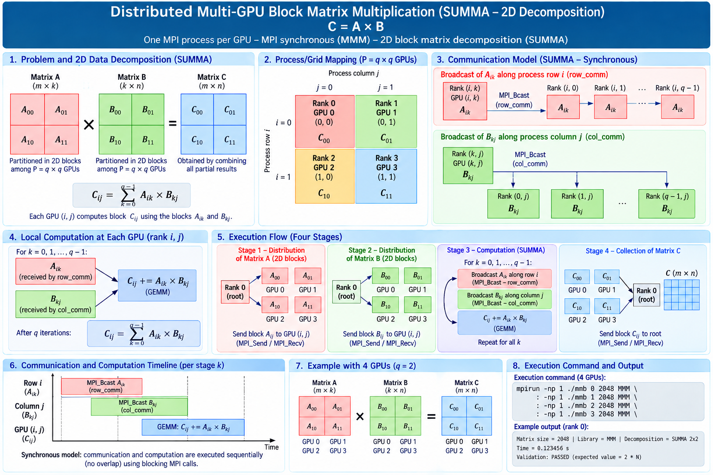

# Distributed Multi-GPU Matrix Multiplication — 2D SUMMA

This project implements and compares **seven communication/computation strategies** for distributed double-precision matrix multiplication on multi-GPU systems. All models use the same **2D block decomposition based on SUMMA (Scalable Universal Matrix Multiplication Algorithm)**, allowing the experiments to focus on data movement, GPU data residence, synchronization, chunking, and communication/computation overlap.



## 1. Research objective

The project investigates how different communication APIs and scheduling strategies affect the performance of distributed multi-GPU matrix multiplication.

The main questions are:

- How does **host vs. GPU data residence** affect communication cost?
- What is the impact of **blocking vs. nonblocking communication**?
- When does **K-dimension chunking** create useful pipeline opportunities?
- How much can **communication/computation overlap** reduce execution time?
- How do MPI, CUDA-Aware MPI, NCCL, and NVSHMEM behave under the same 2D SUMMA decomposition?
- How do synchronization, buffer reuse, and data locality influence GPU utilization and scalability?

The current implementation is primarily a **single-node / four-GPU experimental framework**, but the decomposition is formulated for $P = q^2$ MPI ranks.

---

## 2. Communication models

| Label | Model | Main communication mechanism | Chunking | Intended overlap |
|---|---|---|---|---|
| `MMM` | MPI-SYNC | Blocking `MPI_Bcast` through host buffers | No | None |
| `YYY` | MPI-ASYNC | `MPI_Ibcast` + pinned host buffers + asynchronous H2D | A and B | Communication / H2D / GEMM pipeline |
| `CCC` | CUDA-Aware MPI-SYNC | Blocking `MPI_Bcast` directly on CUDA buffers | No | None |
| `XXX` | CUDA-Aware MPI-ASYNC | `MPI_Ibcast` directly on GPU buffers | B | B communication / GEMM |
| `NNN` | NCCL  | `ncclBroadcast` on CUDA streams | B | B communication / GEMM |
| `WWW` | NVSHMEM-SYNC | Blocking `nvshmem_getmem` | No | None |
| `SSS` | NVSHMEM-ASYNC | `nvshmemx_getmem_nbi_on_stream` + double buffering | B | NVSHMEM GET / GEMM |

> **Important:** an asynchronous API, nonblocking collective, or use of multiple CUDA streams does not by itself prove real overlap. Actual concurrency must be verified with profiling on the target platform.

---

## 3. 2D block matrix decomposition

For square matrices

```text
C = A × B
```

the MPI ranks are arranged as a `q × q` logical grid, where

```text
P = q²
q = sqrt(number_of_MPI_ranks)
bs = N / q
```

Each rank `(i,j)` owns one block of `A`, one block of `B`, and computes one block of `C`:

```text
Cij = Σk Aik × Bkj
```

or, at each SUMMA step,

```text
Cij ← Cij + Aik × Bkj
```

For four MPI ranks (`q = 2`):

```text
             Matrix A                    Matrix B                    Matrix C

        +----------+----------+      +----------+----------+      +----------+----------+
        |   A00    |   A01    |      |   B00    |   B01    |      |   C00    |   C01    |
        |          |          |      |          |          |      |  GPU 0   |  GPU 1   |
        +----------+----------+      +----------+----------+      +----------+----------+
        |   A10    |   A11    |      |   B10    |   B11    |      |   C10    |   C11    |
        |          |          |      |          |          |      |  GPU 2   |  GPU 3   |
        +----------+----------+      +----------+----------+      +----------+----------+
```

Therefore:

```text
GPU 0: C00 = A00 × B00 + A01 × B10
GPU 1: C01 = A00 × B01 + A01 × B11
GPU 2: C10 = A10 × B00 + A11 × B10
GPU 3: C11 = A10 × B01 + A11 × B11
```

This is the decomposition used by all seven communication models.

### Rank-to-GPU mapping for the supplied four-GPU launch

| MPI rank | GPU | Process-grid coordinate | Result block |
|---:|---:|---|---|
| 0 | 0 | `(0,0)` | `C00` |
| 1 | 1 | `(0,1)` | `C01` |
| 2 | 2 | `(1,0)` | `C10` |
| 3 | 3 | `(1,1)` | `C11` |

At SUMMA step `k`, the required `A(i,k)` information moves along the process row and `B(k,j)` along the process column.

---

## 4. Implemented models

### 4.1 MMM — MPI-SYNC

`MMM` is the conventional host-staged synchronous baseline.

Conceptually:

```text
MPI_Bcast(A)
      ↓
H2D(A)
      ↓
MPI_Bcast(B)
      ↓
H2D(B)
      ↓
GEMM
      ↓
cudaDeviceSynchronize()
```

Communication, explicit host-to-device transfers, and computation are serialized.

### 4.2 YYY — MPI-CHUNKED-ASYNC

`YYY` introduces a chunked pipeline using:

- `MPI_Ibcast`;
- pinned host buffers;
- two host/device slots;
- asynchronous H2D copies;
- CUDA streams and events;
- K-dimension chunking.

Its purpose is to investigate whether host-staged MPI communication can be pipelined with GPU data transfers and GEMM execution.

Chunk size:

```bash
export YYY_CHUNK_K=256
```

Default: `1024`.

### 4.3 CCC — CUDA-Aware MPI-SYNC

`CCC` removes application-level host staging from the SUMMA communication loop.

Blocking MPI collectives operate directly on CUDA device buffers:

```text
GPU buffer
    ↓
MPI_Bcast
    ↓
GPU buffer
    ↓
GEMM
```

This model is synchronous and provides a baseline for comparison with `XXX`.

### 4.4 XXX — CUDA-Aware MPI-ASYNC

`XXX` combines CUDA-aware nonblocking MPI communication with B-panel K chunking.

The intended pipeline is:

```text
Communication:  B0 ------ B1 ------ B2 ------ B3
                 |         |         |
Compute:         GEMM0 --- GEMM1 --- GEMM2 --- GEMM3
```

It uses `MPI_Ibcast`, CUDA device buffers, ping-pong receive buffers, CUDA events, and a separate compute stream.

Chunk size:

```bash
export XXX_CHUNK_K=256
```

Default: `1024`.

### 4.5 NNN — NCCL-ASYNC

`NNN` uses NCCL communicators corresponding to the SUMMA process rows and columns.

It combines:

- `ncclBroadcast`;
- CUDA-resident communication buffers;
- B-panel K chunking;
- communication and compute streams;
- CUDA events;
- ping-pong buffers.

The goal is to overlap the broadcast of chunk `c+1` with the GEMM of chunk `c`.

Chunk size:

```bash
export NNN_CHUNK_K=256
```

Default: `1024`.

### 4.6 WWW — NVSHMEM-SYNC

`WWW` is the synchronous NVSHMEM baseline.

For every SUMMA step, the implementation obtains complete A and B panels using blocking `nvshmem_getmem`, executes the GEMM, synchronizes the GPU, and performs the required NVSHMEM synchronization.

Conceptually:

```text
GET A(i,k)
     ↓
GET B(k,j)
     ↓
GEMM
     ↓
GPU synchronization
     ↓
next SUMMA step
```

`WWW` intentionally does **not** implement chunking or communication/computation overlap. It provides the synchronous control case for the NVSHMEM experiments.

### 4.7 SSS — NVSHMEM-CHUNKED-ASYNC

`SSS` is the asynchronous NVSHMEM implementation.

It keeps A as a full SUMMA panel while B is partitioned along K. Remote B chunks are fetched using:

```text
nvshmemx_getmem_nbi_on_stream()
```

The implementation combines:

- stream-ordered nonblocking NVSHMEM GETs;
- `nvshmemx_quiet_on_stream`;
- two B ping-pong buffers;
- a communication stream;
- a compute stream;
- CUDA `ready` / `done` events;
- K-dimension chunking;
- avoidance of the corresponding remote GET when the required data is locally owned.

The intended steady-state pipeline is:

```text
Communication stream:  GET B0 ---- GET B1 ---- GET B2 ---- GET B3
                           |           |           |
                           v           v           v
Compute stream:         GEMM B0 ---- GEMM B1 ---- GEMM B2 ---- GEMM B3
```

The double-buffer scheme prevents a communication operation from overwriting a buffer that is still being consumed by the GEMM.

Chunk size:

```bash
export SSS_CHUNK_K=256
```

Default: `1024`.

---

## 5. Chunk size and overlap

For four ranks, `q=2`, therefore:

```text
bs = N / 2
```

The number of B chunks per SUMMA panel is approximately:

```text
ceil(bs / CHUNK_K)
```

With the default `CHUNK_K=1024`:

| N | Local block `bs` | B chunks/panel |
|---:|---:|---:|
| 2048 | 1024 | 1 |
| 4096 | 2048 | 2 |
| 8192 | 4096 | 4 |
| 16384 | 8192 | 8 |
| 32768 | 16384 | 16 |

This matters experimentally. At `N=2048`, a chunk size of `1024` produces only **one B chunk per panel**, so there is no within-panel `B[c+1]` / `GEMM[c]` overlap opportunity.

For overlap experiments, useful values include:

```bash
export YYY_CHUNK_K=256
export XXX_CHUNK_K=256
export NNN_CHUNK_K=256
export SSS_CHUNK_K=256
```

Smaller chunks increase pipeline opportunities but also increase collective, event, launch, and scheduling overhead.

---

## 6. Project structure

```text
2D-block-matrix/
├── README.md
├── makefile
├── mmb.cu
├── mulmat_kernel.cu
├── native-execution-script.sh
├── slurm-execution-script.sh
├── plot.py
├── img/
│   └── 1.png
└── experimental-results/
    ├── result--2048-32768-1node-4GPUs-MMM.txt
    ├── result--2048-32768-1node-4GPUs-YYY.txt
    ├── result--2048-32768-1node-4GPUs-CCC.txt
    ├── result--2048-32768-1node-4GPUs-XXX.txt
    ├── result--2048-32768-1node-4GPUs-NNN.txt
    ├── result--2048-32768-1node-4GPUs-WWW.txt
    ├── result--2048-32768-1node-4GPUs-SSS.txt
    ├── execution_time.png
    └── speedup.png
```

---

## 7. Build

The Makefile expects the following environment variables:

```bash
CUDA_HOME
NCCL_HOME
NVSHMEM_HOME
```

The project is currently compiled for NVIDIA Volta (`sm_70`).

Build:

```bash
make
```

Clean:

```bash
make clean
```

The executable generated is:

```text
mmb
```

---

## 8. Execution

Program interface:

```bash
./mmb <device_id> <matrix_size> <MMM|YYY|CCC|XXX|NNN|WWW|SSS>
```

Example using four GPUs:

```bash
mpirun -np 1 ./mmb 0 8192 SSS : \
       -np 1 ./mmb 1 8192 SSS : \
       -np 1 ./mmb 2 8192 SSS : \
       -np 1 ./mmb 3 8192 SSS
```

### Native execution

```bash
bash native-execution-script.sh
```

The script evaluates:

```text
N = 2048, 4096, 8192, 16384, 32768
```

for all seven models.

### SLURM execution

Submit:

```bash
sbatch slurm-execution-script.sh
```

The supplied SLURM script requests:

```text
1 node
4 GPUs
partition: sequana_gpu_dev
```

and loads the NVSHMEM and Python/Anaconda modules used by the target environment.

---

## 9. Numerical validation

The matrices are initialized such that:

```text
A[i,j] = 1
B[i,j] = 2
```

Therefore:

```text
C[i,j] = 2 × N
```

The execution output reports:

```text
NUMERICAL VALIDATION
Expected C[i,j]
Elements checked
Invalid elements
Max absolute error
Max relative error
Result
```

Only runs reporting:

```text
Result : PASS
```

should be used in performance comparisons.

Constant matrices provide a convenient correctness check, but future validation can be strengthened with deterministic nonconstant inputs and a CPU reference for small matrices.

---

## 10. Experimental results

The repository contains measured result files for all seven models under:

```text
experimental-results/
```

The supplied measurements correspond to the four-GPU SUMMA configuration and include matrix sizes from `2048` through `32768`.

The repository also contains:

```text
experimental-results/execution_time.png
experimental-results/speedup.png
```

These results should be interpreted as measurements of the **specific implementations and platform configuration used in the experiment**, rather than as general performance limits of MPI, NCCL, or NVSHMEM.

For publication-quality experiments, collect multiple independent runs and report a statistic such as median together with dispersion.

