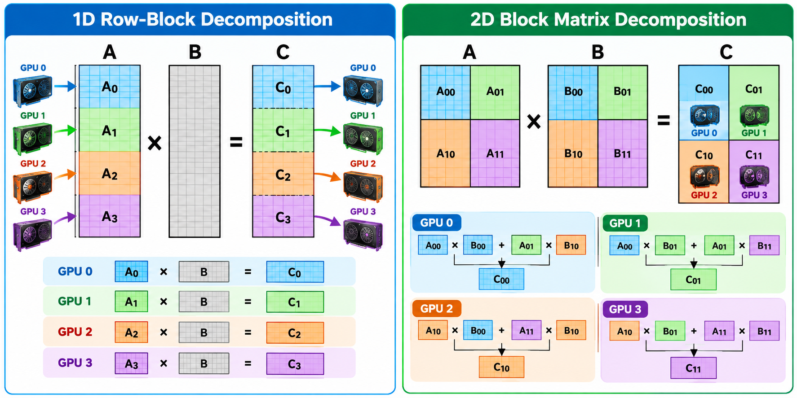
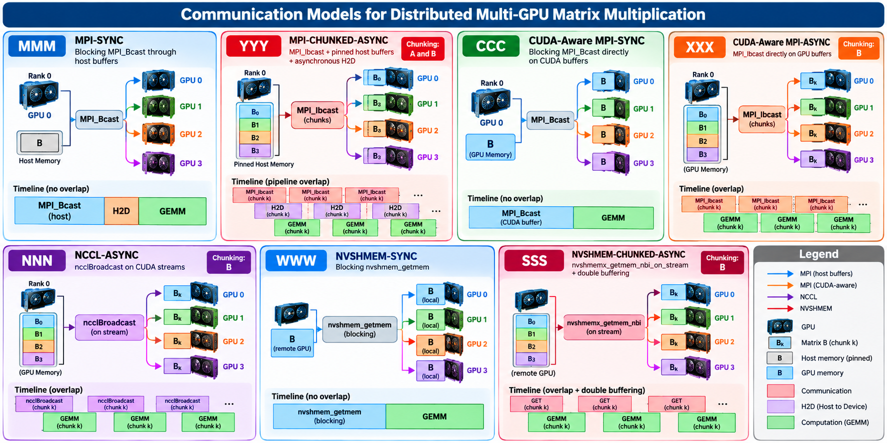

# Distributed Multi-GPU Matrix Multiplication

Visual overview of the **domain-decomposition schemes** and
**communication models** used in the distributed multi-GPU
matrix-multiplication benchmarks.

## `Domain Decomposition`

The benchmark considers two matrix-decomposition strategies.

### Scheme #1 --- 1D Row-Block Decomposition

Matrix $A$ is partitioned by rows among the GPUs, while the complete
matrix $B$ is required by every participating GPU.

$$
C_i = A_i B
$$

### Scheme #2 --- 2D Block Matrix Decomposition

Matrices are partitioned into two-dimensional blocks. Each output block
is computed from the corresponding blocks of $A$ and $B$.

$$
C_{ij} = \sum_k A_{ik} B_{kj}
$$

This scheme follows the block-oriented organization used by **SUMMA
(Scalable Universal Matrix Multiplication Algorithm)**.

## `Communication Models`

The benchmark compares synchronous, asynchronous, CUDA-aware, NCCL, and
NVSHMEM communication strategies.

| Label | Model | Main communication mechanism | Chunking | Intended overlap |
|:-----:|---|---|:---:|---|
| `MMM` | **MPI-SYNC** | Blocking `MPI_Bcast` through host buffers | No | None |
| `YYY` | **MPI-CHUNKED-ASYNC** | `MPI_Ibcast` + pinned host buffers + asynchronous H2D | A and B | Communication / H2D / GEMM pipeline |
| `CCC` | **CUDA-Aware MPI-SYNC** | Blocking `MPI_Bcast` directly on CUDA buffers | No | None |
| `XXX` | **CUDA-Aware MPI-ASYNC** | `MPI_Ibcast` directly on GPU buffers | B | B communication / GEMM |
| `NNN` | **NCCL-ASYNC** | `ncclBroadcast` on CUDA streams | B | B communication / GEMM |
| `WWW` | **NVSHMEM-SYNC** | Blocking `nvshmem_getmem` | No | None |
| `SSS` | **NVSHMEM-CHUNKED-ASYNC** | `nvshmemx_getmem_nbi_on_stream` + double buffering | B | NVSHMEM GET / GEMM |

## `Visual Summary`

The two figures highlight the two main dimensions investigated by the
benchmark:

### Communication and Computation

The communication models can be organized according to how communication
and GPU computation are coordinated:

| **Synchronous** | **Chunked / Asynchronous** |
|:---:|:---:|
| Communication completes first | Data is transferred in chunks |
| ↓ | ↓ |
| **Communication** | **Communication** ─────► |
| ↓ | ↕ **Overlap** |
| **GEMM** | **GEMM** ───────► |
| Sequential execution | Pipelined execution |
| **No overlap** | **Communication + Computation overlap** |

#### Key Idea

> **Synchronous:** Communication ──► GEMM  
>
> **Asynchronous:** Communication || GEMM

The asynchronous models are designed to investigate whether communication
can be **hidden behind GPU computation** through:

- **Chunking** — divides data into smaller communication units;
- **CUDA streams** — enables concurrent GPU operations;
- **Nonblocking communication** — allows computation to proceed while data is transferred;
- **Double buffering** — overlaps communication of the next chunk with computation of the current chunk.